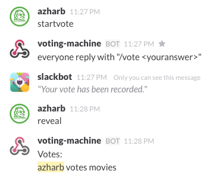

## Slack Vote

Based on NodeJS and MongoDB. 

###Configure
Add a configuration file to the root of the project called "config.json" with the following values:

```
{
	"appAccessToken" : "your-access-token",
	"outgoingToken" : "yourOutgoingToken",
	"commandToken" : "yourCommandToken"
}
```

Slack app can be created here: [link](https://api.slack.com/applications)

Outgoing webhooks can be created here: [link](https://api.slack.com/outgoing-webhooks)

Slack commands can be created here: [link](https://api.slack.com/slash-commands)

###Use


Public channels allow the following commands:

* 'startvote' - asks Slack to notify web app to expect votes from channel members
* 'reveal' - shows everyone's votes with their names
* 'reveal anon' - shows everyone's votes **without** their names
* 'votecount' - shows the number of votes that have been cast so far